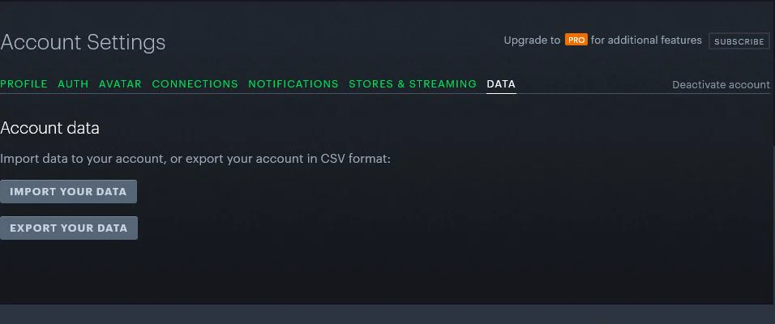
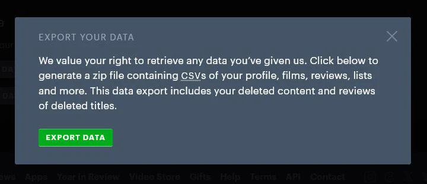

<!-- Generated by npm run docs:setup. Edit src/app/setup-guide-definitions.js instead. -->

# Import Letterboxd

Compare your Letterboxd history with Rapid Rater without sharing a Letterboxd password.

> Security: Use disposable test accounts and non-personal sample data. Cover cookies, API keys, emails, names, and identifiers with solid opaque blocks before saving. Never blur a secret and never place an unredacted source image in the repository. Inspect the final image at full resolution and remove metadata before adding it.

## 1. Open your data settings

Sign in to Letterboxd and open its data settings page.

[Open Letterboxd data settings](https://letterboxd.com/settings/data/)

Last verified: Pending screenshot capture.

## 2. Download your export

Choose Export your data and save the ZIP file when Letterboxd finishes preparing it.

Last verified: Pending screenshot capture.

## 3. Choose the ZIP

In Sync Movies, choose Import Letterboxd and select the ZIP you downloaded.

In Rapid Rater: **Choose Letterboxd export**

> **Screenshot needed:** Rapid Rater Sync Movies page with Import Letterboxd highlighted before the system file picker opens.
>
> **Solid-redact:** Signed-in email

Last verified: Pending screenshot capture.

## 4. Review the comparison

Rapid Rater shows matches, missing ratings, conflicts, and titles that still need an IMDb match.

In Rapid Rater: **Open Sync Movies**

> **Screenshot needed:** Rapid Rater Sync Movies after import, with non-sensitive example counts and review sections visible.
>
> **Solid-redact:** Signed-in email, Personally identifying watch history

Last verified: Pending screenshot capture.
