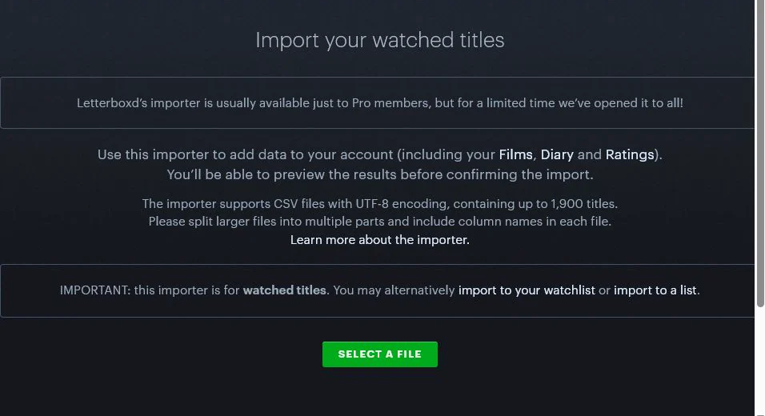

<!-- Generated by npm run docs:setup. Edit src/app/setup-guide-definitions.js instead. -->

# Send Rapid Rater ratings to Letterboxd

Create a Letterboxd-ready file, then review it on Letterboxd before anything changes.

> Security: Use disposable test accounts and non-personal sample data. Cover cookies, API keys, emails, names, and identifiers with solid opaque blocks before saving. Never blur a secret and never place an unredacted source image in the repository. Inspect the final image at full resolution and remove metadata before adding it.

## 1. Start with fresh exports

Import your latest IMDb ratings CSV and Letterboxd ZIP so the comparison is current.

In Rapid Rater: **Open Sync Movies**

> **Screenshot needed:** Rapid Rater Sync Movies showing both source imports complete with safe example totals.
>
> **Solid-redact:** Signed-in email, Personally identifying watch history

Last verified: Pending screenshot capture.

## 2. Download the import file

Under Rapid Rater to Letterboxd, choose Download file to upload to Letterboxd.

In Rapid Rater: **Download Letterboxd file**

> **Screenshot needed:** Rapid Rater to Letterboxd sync section with the download control highlighted and a safe count.
>
> **Solid-redact:** Signed-in email, Personally identifying titles

Last verified: Pending screenshot capture.

## 3. Open Letterboxd import

Open Letterboxd's importer after the Rapid Rater download finishes.

[Open Letterboxd import](https://letterboxd.com/import/)

Last verified: Pending screenshot capture.

## 4. Upload the file

Choose the downloaded CSV. If you received a ZIP, unzip it and upload each CSV one at a time.

> **Screenshot needed:** Letterboxd importer after a sanitized generated CSV is selected and before final confirmation.
>
> **Solid-redact:** Member name, Local file path, Personally identifying titles

Last verified: Pending screenshot capture.

## 5. Review and confirm

Check Letterboxd's preview, fix any matches it flags, then confirm the import.

> **Screenshot needed:** Letterboxd import preview with safe sample films and the final confirmation control visible.
>
> **Solid-redact:** Member name, Personally identifying titles, Import identifiers

Last verified: Pending screenshot capture.
